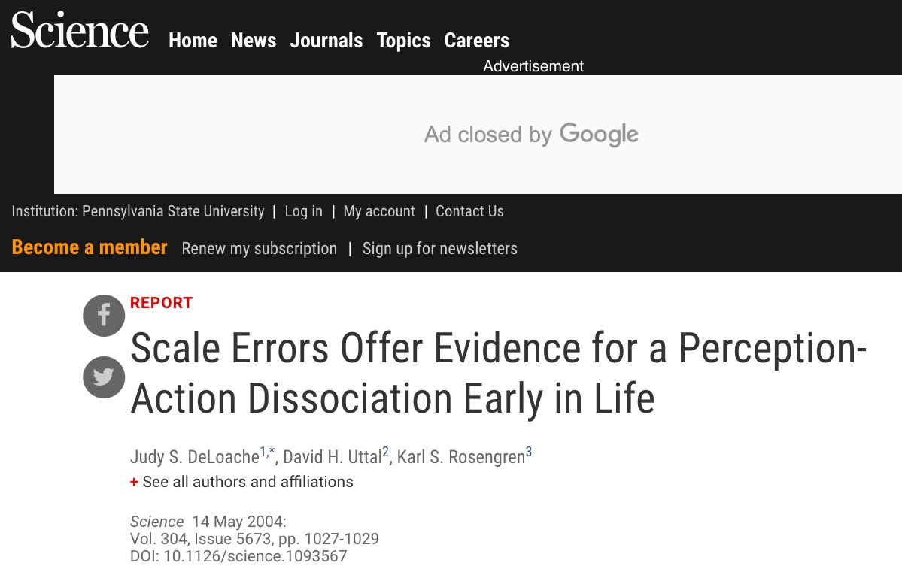
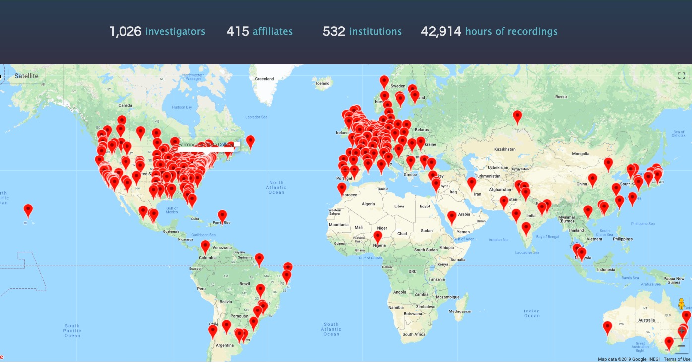
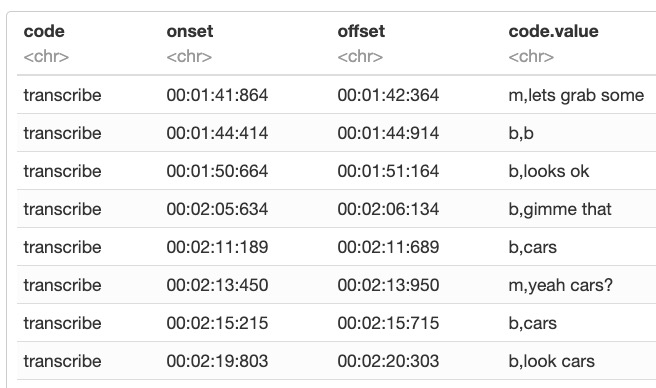
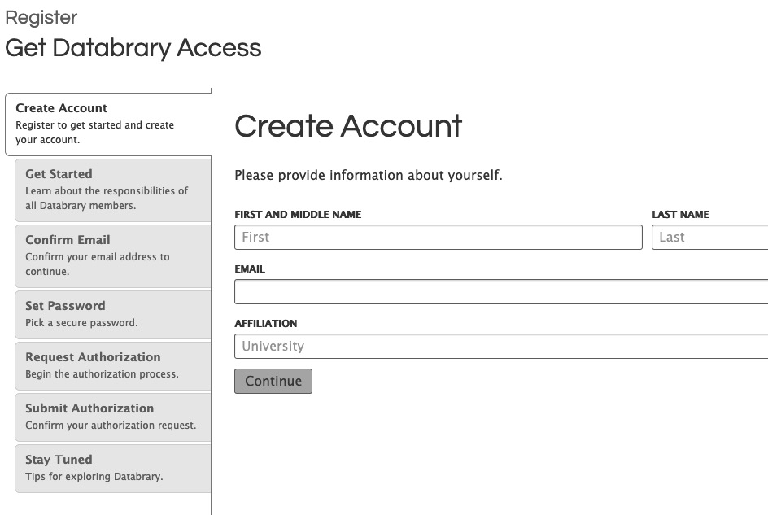

```{r setup, include=FALSE}
knitr::opts_chunk$set(echo = FALSE, cache=TRUE)
source('R/write_video_clip_html.R')

if(!require(databraryapi)){
  if(!require(devtools)){
    install.packages('devtools')
  }
  devtools::install_github('PLAY-behaviorome/databraryapi')
}
library(databraryapi)

if(!require(tidyverse)){
  install.packages('tidyverse')
}
library(tidyverse)

if (!require(qrcode)) {
  install.packages('qrcode')
}
library(qrcode)

# Log-in to Databrary
logged_in <- databraryapi::login_db(params$db_login)
```

# Preliminaries

---

<!-- QR code for talk -->

```{r qr-code, echo=FALSE, warning=FALSE, message=FALSE}
talk_url <- 'https://gilmore-lab.github.io/2019-08-28-apsa/'
qrcode::qrcode_gen(talk_url)
```

---

<!-- Funding sources with icons -->


</br>


</br>


<div class="notes">
I thank NSF, NIH, the Alfred P. Sloan Foundation, SRCD, the Lego Foundation, and the James S. McDonnell Foundation for support.
</div>

## Overview

- Video as data
- Video as documentation
- Sharing ethically & securely with Databrary
- Accelerating discovery

<div class="notes">
I'll be talking about video as data and documentation, how video can be shared ethically and securely, and how video sharing will accelerate discovery in the psychological sciences.
</div>

# Video as data & documentation

---


<small>
[Adolph, Gilmore, & Kennedy, 2017](https://www.apa.org/science/about/psa/2017/10/video-data)
</small>

<!-- Video as data and documentation -->

## Video as data

---

```{r, results='asis', echo=FALSE}
write_video_clip_html('https://nyu.databrary.org/slot/9840/-/asset/11192/download?inline=true', vid_w_pix = 640, vid_h_pix = 480, show_link = FALSE)
```

<small>
[Frank 2014](http://doi.org/10.17910/B7PP4W)
</small>

<!-- Physical abacus -->

<div class="notes">
Well, let me explain, or better, show. Tell me what's going on in this short clip?
</div>

---

```{r, results='asis', echo=FALSE}
write_video_clip_html('https://nyu.databrary.org/slot/9840/-/asset/11193/download?inline=true', vid_w_pix = 640, vid_h_pix = 480, show_link = FALSE)
```

<small>
[Frank 2014](http://doi.org/10.17910/B7PP4W)
</small>

<!-- Mental abacus -->

<div class="notes">
And how about this one?

That's right. It's a mental abacus.
</div>

---

<iframe src="http://doi.org/10.17910/B7PP4W" height=600 width=1000>
</iframe>

<small>
[Frank 2014](http://doi.org/10.17910/B7PP4W)
</small>

<div class="notes">
And the video let you see the phenomenon directly BEFORE you even read the paper.
</div>

---



<small>
[DeLoache, Uttal, & Rosengren 2004](https://10.1126/science.1093567)
</small>

<div class="notes">
Another example comes from the work of Judy DeLoache and colleagues on some children's surprising errors of spatial scale. DeLoache and colleagues observed that children sometimes tried to sit on tiny doll-sized chairs or insert themselves into tiny doll-sized cars after playing and interacting with full-sized chairs or toys.

When they submitted the paper to Science, the editors didn't believe them.
</div>

## If a picture is worth 1,000 words...

## A video is worth...

---

```{r, results='asis', echo=FALSE}
write_video_clip_html('https://nyu.databrary.org/slot/9850/-/asset/11556/download?inline=true', 
                      vid_w_pix = 640, vid_h_pix = 480, show_link = FALSE)
```

<small>
[DeLoache 2014](http://doi.org/10.17910/B7H019)
</small>

---

```{r, results='asis', echo=FALSE}
write_video_clip_html('https://nyu.databrary.org/slot/9850/-/asset/11550/download?inline=true', vid_w_pix = 640, vid_h_pix = 480, show_link = FALSE)
```

<small>
[DeLoache 2014](http://doi.org/10.17910/B7H019)
</small>

## ...a paper in *Science*

## Video...

- Captures (& preserves)
- Shows (& helps tell...)
- Expands the scope of inquiry (e.g., words +)
- Provides unparalleled opportunities for reuse

<div class="notes">
Video captures and preserves aspects of behavior that other measures often neglect; it shows what participants do and helps tell the story; it expands the scope of inquiry to include other behaviors; and it provides unparalleled opportunities for reuse.

Video also has unique strengths as research documentation.
</div>

## Video as documentation

---

<div class="centered">

</br>
<small>
[Baker, 2016](http://doi.org/10.1038/533452a)
</small>
</div>

<div class="notes">
These are the results.
</div>

---

<div class="centered">

</br>
<small>
[Baker, 2016](http://doi.org/10.1038/533452a)
</small>
</div>

<div class="notes">
</div>

---

<div class="centered">

</br>
<small>
[Baker, 2016](http://doi.org/10.1038/533452a)
</small>
</div>

<div class="notes">
</div>

---

```{r, out.width = "1000px"}
knitr::include_graphics("img/video-can-make-behavioural.jpg")
```

<small>
[Gilmore & Adolph, 2017](https://doi.org/10.1038/s41562-017-0128)
</small>

<div class="notes">
Karen Adolph and I argue that video recordings of research procedures can make behavioral science more reproducible. Here are some examples.
</div>

---

<!-- Caitlyn Fausey accidental and intentional videos -->

```{r}
knitr::include_url("http://doi.org/10.17910/b7.873", height = 600)
```

---

```{r}
knitr::include_url("http://doi.org/10.17910/B7.236", height = 600)
```

---

```{r, results='asis', echo=FALSE}
write_video_clip_html("https://nyu.databrary.org/slot/11647/0,84928/asset/40653/download?inline=true", vid_w_pix = 1000, show_link = FALSE)
```

<small>
[Yu 2016](http://doi.org/10.17910/B7.236)
</small>

<div class="notes">
Let's say you're interested in where children and their parents look to explore the role of joint attention in early word learning.

This video from Databrary shows what the raw video from eyetracking systems used by Yu et al. actually looks like.
</div>

---

<iframe src="http://doi.org/10.17910/B7.326" height=600 width=1000>
</iframe>

<small>
[Bahrick, 2017](http://doi.org/10.17910/B7.326)
</small>

<div class="notes">
Or maybe you are interested in understanding more Lorraine Bahrick's multisensory assessment protocol.
</div>

---

```{r, results='asis', echo=FALSE}
write_video_clip_html('https://nyu.databrary.org/slot/16668/0,140984/asset/72645/download?inline=true', vid_w_pix = 1000, show_link = FALSE)
```

<div class="notes">
This video on Databrary shows what it looks like from a participant's perspective.
</div>

## Even audio

<div class="notes">
Audio recordings can also be shared.
</div>

---

```{r}
knitr::include_url("http://doi.org/10.17910/b7.339", height = 600)
```

<small>
[Cole, Gilmore, Perez-Edgar, & Scherf 2017](http://doi.org/10.17910/b7.339)
</small>

<div class="notes">
I'm largely a vision scientist, but more generally I'm interested in perceptual and motor development. In collaboration with other colleagues at Penn State, we've been exploring behavioral and neural responses to maternal speech in different affective prosodies.
</div>

---


<audio controls>
<source src="https://nyu.databrary.org/slot/16956/110000,120032/asset/73386/download?inline=true">
</audio>
</br>
<audio controls>
<source src="https://nyu.databrary.org/slot/16956/0,10032/asset/73350/download?inline=true">
</audio>

<small>
[Cole, Gilmore, Perez-Edgar, & Scherf 2017](http://doi.org/10.17910/b7.339)
</small>

<div class="notes">
Here are two examples. The full set of recordings are shared on Databrary for the research community to use.
</div>

## Shared video & audio recordings

<div class="notes">
</div>

---

- Make research more transparent
- Bolster the reproducibility of procedures
- Accelerate the adoption of new research techniques

---

- Strengthen findings
- Maximize the return on public investments in research

# Sharing video ethically & openly

## Video must be protected

<div class="notes">
Sharing video ethically requires protections.
</div>

---

- Faces, voices
- Home interiors
- Behaviors that may embarrass participants

<div class="notes">
Video is potentially identifiable. It contains faces and voices. It might contain images of home interiors or capture behaviors that could embarrass participants.
</div>

## Open sharing advances discovery

<div class="notes">
At the same time, open sharing, with limited restrictions on appropriate uses, promises to advance discovery.

How do we strike a balance between the two?
</div>

---

- Citation expected, but 
- No requirement for co-authorship
- No pre-approval of research questions

<div class="notes">
Databrary does not pre-approve research questions nor enforce requirements for co-authorship, but we expect that any researcher using our materials to cite the source.
</div>

---


## Requires...

- researchers secure participant permission to share
- IRB/ethics board approval to share
- institutional approval for access

<div class="notes">
Moreover, Databrary requires researchers to secure permission from research participants in order to share their video or audio data. Databrary requires researchers seek ethics board approvals as required by a researcher's institution. And most importantly, Databrary restricts access to researchers who have been authorized by their institutions to access the site.
</div>

## Permission to share

- Standard language via [templates](https://www.databrary.org/resources/templates.html)
- When to ask & how decided by local ethics boards/IRBs
- Sample [scripts](https://www.databrary.org/resources/guide/investigators/release/asking/script.html) and [videos](https://www.databrary.org/resources/guide/investigators/release/asking/examples.html)

<div class="notes">
Databrary has developed standard language for seeking permission to share and provides guidance about when and how to seek ethics board approval. We share sample scripts for talking with participants alongside video exemplars. 

Some researchers might be uncertain about how to ask parents or participants for permission to share video or audio, so Databrary includes videos that show how easy it is.
</div>

---

```{r, results='asis', echo=FALSE}
write_video_clip_html('https://www.databrary.org/video/example-video-1.mp4', vid_h_pix = 600, vid_w_pix = 800, show_link = FALSE)
```

<div class="notes">
</div>

## Restricting access

- Researchers at institutions
- Formalized by an [institutional agreement](https://www.databrary.org/resources/agreement.html)
- Protects participants, researchers, & institutions

<div class="notes">
Only researchers whose institutions have granted explicit access are permitted to share data. Student or staff affiliates an authorized researcher supervises may download or resuse Databrary materials if granted access by their supervisor. A researcher's institution must sign a formal institutional agreement with NYU, Databrary's host institution, before a researcher gains full access.

This policy framework protects participants, researchers, and institutions.
</div>

## Standardized [levels of sharing](https://www.databrary.org/resources/guide/investigators/release/release-levels.html)

<div class="notes">
Databrary has standardized the levels of sharing into categories; every file on the site is tagged with the level of sharing permitted.
</div>

---

<!--  -->

```{r, cache=FALSE, out.width="1000px"}
knitr::include_graphics("img/sharing-levels.jpg")
```

<div class="notes">
Private files are restricted to the authorized researcher who uploaded them and any other parties they grant access to.</div>

---

```{r, out.width = "1100px", cache=FALSE}

```

<div class="notes">
As this map indicates, the Databrary policy framework has been agreed to by hundreds of institutions across the globe.
</div>

# Accelerating discovery

## Need

- Annotation tools
- More (bigger, denser, diverse) data
- Platforms for discovery

<div class="notes">
To exploit the power of video to accelerate discovery in behavioral science, we need annotation tools, bigger data, and software tools that go beyond passive data storage but are truly platforms for discovery.
</div>

---

<video src="mov/databrary-splash.mp4" data-autoplay loop/>
</video>

<div class="notes">
Databrary is one such tool.
</div>

---

<iframe src="https://datavyu.org" height=600 width=1000>
</iframe>

<div class="notes">
Datavyu, a free open-source, annotation tool is another.
</div>

---

```{r, results='asis', echo=FALSE}
write_video_clip_html("https://nyu.databrary.org/slot/27087/0,372193/asset/119877/download?inline=true", vid_w_pix = 800, vid_h_pix = 600, show_link = FALSE)
```

<small>
[Adolph, Tamis-LeMonda, & Gilmore 2017](https://nyu.databrary.org/volume/444#panel-data)
</small>

<div class="notes">
We're also creating a large-scale, diverse and rich data set for others to exploit via the Play & Learning Across a Year (PLAY) Project.
</div>

---

- $n=900$ infant/mother dyads, $n=300$ 12-, 18-, and 24-month-olds
- Demographics, health status, media use, temperament
- Modified MB-CDI (interview, video-recorded, English/Spanish item-level equivalents)
- Open protocol, video documentation

---

<iframe src="https://play-project.org/" height=600 width=1000>
</iframe>

<div class="notes">
The entire PLAY project protocol, including videos of procedures, coding definitions, survey items, etc. is openly shared.
</div>

## Platforms for discovery

<div class="notes">
Platforms for discovery require software that interacts with stored and shared data in interesting and useful ways.

We're making progress on this front, too.
</div>

---

<iframe src="https://nyu.databrary.org/volume/8" height=600 width=1000>
</iframe>

<small>
[Tamis-LeMonda 2013](http://doi.org/10.17910/B7CC74)
</small>

<div class="notes">
Here's one of the largest currently shared datasets on Databrary from Catherine Tamis-LeMonda.

Maybe you're interested in seeing whether it is large and diverse enough for your needs.
</div>

---

```{r vol-8-table, include=TRUE, echo=TRUE}
vol_8 <- databraryapi::download_session_csv(vol_id = 8)
xtabs(formula = ~ participant.gender + participant.race, data = vol_8) %>%
  knitr::kable(.)
```

<div class="notes">
Using a few commands in the R programming language, you can securely download the entire demographic dataset from Databrary and plot a tabular summary.
</div>

---

```{r vol-8-race-by-gender, include=TRUE, echo=TRUE}
race_gender <- vol_8 %>%
  filter(participant.gender %in% c('Male', 'Female')) %>%
  ggplot() +
  aes(x = participant.race, fill = participant.race) +
  facet_grid(. ~ participant.gender) +
  geom_bar(stat="count") +
  coord_flip() +
  theme(axis.text.x = element_text(angle = 90, hjust = 1, size = 16),
        axis.title = element_text(size = 16),
        strip.text = element_text(size = 16),
        legend.position = "bottom")
```

<div class="notes">
Or you can create a plot of the data for a report to your collaborators.
</div>

---

```{r plot-race-gender, echo=FALSE}
race_gender
```

---

```{r, echo=TRUE, message=FALSE, warning=FALSE, error=FALSE}
databraryapi::login_db(email = "rogilmore@psu.edu")

play_session_id <- 26295
play_vol_id <- 444

vol_444_assets <- list_assets_in_session(vol_id = play_vol_id, 
                                         session_id = play_session_id) %>%
  select(name, asset_type, asset_id)
```

<div class="notes">
Maybe you're interested in reusing the PLAY project pilot data and want to know what other types of data files are available.
</div>

---

```{r, echo=FALSE}
knitr::kable(vol_444_assets)
```

---

```{r prepare-lang-exp-plot, include=TRUE, message=FALSE, warning=FALSE, error=FALSE, echo=TRUE}
lang_exp <- databraryapi::read_csv_data_as_df(session_id = play_session_id,
                                              asset_id = 116787)

lang_exp_plot <- lang_exp %>%
  ggplot(.) +
  aes(x = language, fill = language) +
  facet_grid(exposure_context ~ .) +
  geom_histogram(stat='count') +
  theme(axis.text = element_text(size = 16),
        strip.text = element_text(size = 16),
        axis.title = element_text(size = 13),
        legend.position = "none")
```

<div class="notes">
Since you're a language researcher, you're especially interested in the types of languages children are exposed to and in what settings.
</div>

---

```{r plot-lang-exp, echo=FALSE}
lang_exp_plot
```

<div class="notes">
A few commands later, those data are available to you.
</div>

---

<!-- Databrary splash loop -->
<div class="centered">
<video width="900" controls data-autoplay loop>
  <source src="mov/databrary-splash.mp4" type="video/mp4">
Your browser does not support the video tag.
</video>
</div>

## "Clip" your audio or video

---

- Databrary API returns segments given:
- `start_time, end_time` in milliseconds

<div class="notes">
The Databrary API returns segments of video or audio gven a start_time and an end_time. So you can reproducibly "clip" a particularly interesting audio or video segment to show your collaborators.
</div>

---



---

```{r, results='asis', echo=FALSE}
write_video_clip_html("https://nyu.databrary.org/slot/14514/70009864,70048303/asset/61054/download?inline=true", vid_w_pix = 800, vid_h_pix = 600, show_link = FALSE)
```

## Prepare your video + other data for sharing

---

- Conduct scripted, reproducible visualizations & analyses

<div class="notes">
These scripts will work for ALL other authorized users on Databrary because they call on Databrary itself, not some file on your Box drive.
</div>

## Shared video data & documentation will

---

- Make the behavioral sciences more robust & reproducible
- Accelerate discovery

<div class="notes">
In short, these tools for sharing video as data and documentation will make the behvaioral sciences more robust and reproducible and will accelerate discovery.
</div>

# Next steps...

## Register for Databrary access

---



## Download, test, and help improve the [*databraryapi*](https://github.com/PLAY-behaviorome/databraryapi) and [*databrarypy*](https://github.com/PLAY-behaviorome/databrarypy) packages

## Secure permission to share from research participants

## Collect, upload, & share video and audio recordings

# Thank you

---

<video width="800" data-autoplay>
  <source src="https://github.com/gilmore-lab/DEVSEC-2018/blob/master/mov/databrary-splash.mp4?raw=true" type="video/mp4">
  </video>
<small>
rogilmore@psu.edu</br>
<https://gilmore-lab.github.io></br>
<https://gilmore-lab.github.io/2019-08-28-apsa/></br>
[\@rogilmore](https://twitter.com/rogilmore)
</small>

# Materials

---

<small>
This talk was produced on `r Sys.Date()` in [RStudio](http://rstudio.com) version using R Markdown and the reveal.JS framework.
The code and materials used to generate the slides may be found at <https://github.com/gilmore-lab/2019-08-28-apsa/>.
Information about the R Session that produced the code is as follows:

---

```{r session-info}
sessionInfo()
```

